# Visualize Skill 集成方案：HTML fragment 主协议

## 结论

ant-chat 的可视化协议唯一使用 `ant-chat.visualization.html.v1`。模型调用 `publish_visualization({ title, summary, html })`，后端校验原始 HTML fragment 后生成不可变 artifact；消息只保存 descriptor，Web/Electron 通过受权 RPC 读取 bytes，并在 `iframe sandbox="allow-scripts"` 中加载。

不保留旧 JSON DSL、旧 renderer、未知版本 fallback、通用输入脱敏适配器或 Python runtime。

## 能力边界

- 解释器：流程、状态机、时间线和步骤播放；
- 模拟器：原生表单、参数调整、内联数据和图表刷新；
- 图表：第一方布局与控件，复杂图表可使用固定版本且带 SRI 的 CDN 静态库；
- 原型：卡片、设置面板、Dashboard 和工作流界面；
- 地图、业务 API、登录、权限、数据库、后台任务、远程数据和远程图片不属于 V1。

## 数据流

```mermaid
flowchart LR
  A[模型调用 publish_visualization] --> B[fragment/CDN policy]
  B --> C[生成 file_id sha256 descriptor]
  C --> D[outputBlocks 携带临时 data]
  D --> E[persistedTurn staging]
  E --> F[SQLite 只保存 descriptor]
  F --> G[visualizations.get 鉴权读取]
  G --> H[allow-scripts iframe srcDoc]
  H --> I[MessagePort theme/resize/follow-up]
  I --> J[宿主确认]
  J --> K[next-turn user message]
```



## 安全合同

- fragment 拒绝完整 document、iframe、object、embed、base、meta refresh、inline `on*` 属性、危险 URL、网络 API 和宿主对象；
- iframe 不添加 `allow-same-origin`、forms、popups、top-navigation、downloads 或 modals；
- CSP 固定 `connect-src 'none'`、`img-src data:`、`font-src 'none'`、`font-src 'none'`；
- 外部资源仅限固定 HTTPS CDN URL、精确版本、sha384 SRI 和 `crossorigin="anonymous"`；
- HTML 原文只存在于当前工具执行和 artifact staging；trace、tool-call args、SQLite message args、context trace 和后续模型上下文只保留 descriptor；
- `window.antChatVisualization` 只暴露 `sendFollowUpMessage({ prompt, title? })`；真实用户 gesture 和宿主确认都是必要条件。

## 主题与布局

宿主从应用 CSS variables 读取完整 semantic token，通过 MessagePort 初始化和增量 theme 消息同步到 iframe 的 `document.documentElement`。主题更新不 reload fragment，因此不丢失表单状态。第一方 CSS 提供 `.viz-grid`、`.viz-row`、`.viz-controls`、`.form-*`、`.btn`、`.card`、`.text-muted` 等 class，颜色统一使用 `--viz-*`。

## 实现入口

- 共享合同：`packages/shared/src/schemas/visualization.ts`；
- HTML policy：`packages/shared/src/schemas/visualization.ts`、`apps/web/src/components/Visualization/{fragmentPolicy,cdnPolicy}.ts`；
- artifact：`packages/backend/src/agent-core/tools/publishVisualizationTool.ts`、`persistedTurn.ts`、`sqliteMessageRepository.ts`；
- sandbox：`apps/web/src/components/Visualization/{sandboxDocument,VisualizationFrame,visualization.css}.ts`；
- 本地预览：`scripts/render-visualization.mjs`，仅依赖 Node.js。

## 验收

```bash
pnpm --filter @ant-chat/shared build
pnpm --filter @ant-chat/backend build
pnpm --filter ant-chat build
pnpm type-check
pnpm --filter ant-chat test -- src/components/Visualization
pnpm --filter @ant-chat/backend test -- publishVisualizationTool persistedTurn
pnpm --filter @ant-chat/shared test -- visualization
pnpm lint
```

必须覆盖合法/非法 fragment、固定 CDN/SRI、artifact hash/ownership、完整主题 token、sandbox/CSP、真实 gesture、follow-up 确认和 next-turn 持久化。
